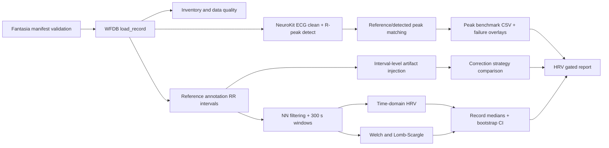
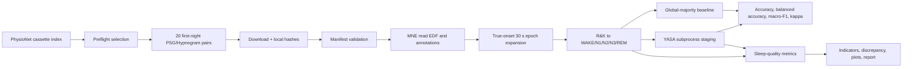
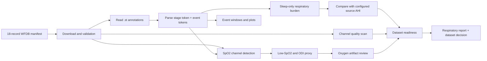

# Physio Signal Lab：工作介绍与使用指南

> 审计对象：`Physiological_Signal_Analysis_no_raw_2026-06-23.zip`
> 审计日期：2026-06-23
> 结论：这是一个**完成度较高的 research/education prototype**，已经形成三条有配置、数据契约、CLI、结果表、图和报告的公开生理信号分析链；它仍不是 clean-checkout 即可复现的 release，也不是 clinical decision-support software。

## 1. 如何理解本指南中的证据

本文将证据分为四类，避免把“仓库里有结果”误写成“本次已经重算成功”。

| 标记 | 含义 | 例子 |
| --- | --- | --- |
| 仓库代码证据 | 直接来自源码、配置、测试或文件结构 | `src/physio_signal_lab/features/hrv_time.py` 中的 SDNN 实现 |
| Tracked artifact 证据 | 归档中已有的 CSV、报告和图片 | `results/sleep_edf/twenty_record_yasa_metrics.csv` |
| 仓库历史陈述 | 仓库内报告记录的历史运行，但本次无法独立复核 | `reports/project/final_state_and_technical_review_response.md` 记录“70 passed” |
| 外部背景 | 官方文档、论文或同类项目，用于解释技术语境 | PhysioNet、SciPy、YASA、HRV Task Force |

本次归档不含 `.git/` 和 `data/raw/`。因此：

- 可以确认源码、配置、测试、tracked outputs 和内部报告的内容；
- 可以对不依赖 raw waveform 的代码做静态检查和部分测试；
- 不能从波形端独立重算三条 pipeline；
- 不能验证内部报告提到的 commit `f971715` 是否对应当前文件快照；
- 不能把 tracked results 当作本次复现实验结果。

## 2. 项目定位与问题定义

### 2.1 项目要解决什么问题

仓库尝试解决的不是单一算法问题，而是“如何把公开生理信号数据做成可审计的分析流程”。直接证据包括：

- [`configs/`](configs/) 固定 dataset selection、algorithm parameters 和 output paths；
- [`data/manifests/`](data/manifests/) 记录 source URL、local path、SHA-256、inclusion status；
- [`src/physio_signal_lab/cli.py`](src/physio_signal_lab/cli.py) 提供 17 个 CLI subcommands；
- [`results/`](results/)、[`reports/`](reports/) 和 [`figures/`](figures/) 保存机器可读输出与解释性产物；
- [`tests/`](tests/) 覆盖数值逻辑、数据契约、report gate 和 release metadata。

项目当前覆盖三个问题域：

1. **ECG / HRV method validation**：R-peak detector benchmark、RR/NN 构造、time/frequency-domain HRV、artifact sensitivity 和 record-level uncertainty。
2. **Sleep staging evaluation**：Sleep-EDF R&K annotations 到五分类映射、global-majority baseline、YASA staging、sleep-quality metrics 和 discrepancy analysis。
3. **Respiratory / SpO₂ educational analysis**：MIT-BIH PSG `.st` annotation token 解析、AHI-style burden、source-AHI alignment、ODI proxy、event windows 和 dataset-readiness gate。

### 2.2 数据集背景

这些背景来自数据集官方页面，不等于仓库自行证明的结论。

- [Fantasia Database v1.0.0](https://physionet.org/content/fantasia/1.0.0/) 包含 20 名年轻和 20 名老年健康受试者的约两小时静息 ECG/respiration 记录，并提供人工核查的 beat annotations。仓库使用全部 40 records。
- [Sleep-EDF Database Expanded v1.0.0](https://physionet.org/content/sleep-edfx/1.0.0/) 含 197 份 whole-night PSG；hypnogram 按 Rechtschaffen & Kales 标准人工评分。仓库只选择 Sleep Cassette cohort 中 subject 400–419 的 first available night，共 20 records。
- [MIT-BIH Polysomnographic Database v1.0.0](https://physionet.org/content/slpdb/1.0.0/) 的 `RECORDS` 文件列出 18 records；仓库默认覆盖全部 18 条，并进一步区分 3 个 pilot records 和 5 个含 oxygen channel 的 records。

### 2.3 目标用户与使用场景

仓库没有一个独立 metadata 字段明确声明 target audience。根据 `reports/project/final_state_and_technical_review_response.md`、各 domain reports 的措辞和 CLI 设计，可以合理判断主要面向：

- 需要公开数据、可追踪参数和结果表的 physiological signal researchers；
- 学习 ECG/HRV、sleep staging 或 respiratory annotation analysis 的技术读者；
- 需要构建 method-development benchmark，而不是直接部署医疗产品的开发者。

“clinical education”“clinical learning”在仓库里是教育性 framing，不是 clinical validation。代码和报告多处明确排除 diagnosis、treatment selection 和 personal baseline claims。

## 3. 技术栈与运行环境

### 3.1 Packaging 与依赖

[`pyproject.toml`](pyproject.toml) 声明：

| 项目 | 仓库状态 |
| --- | --- |
| Package name | `physio-signal-lab` |
| Version | `0.1.0` |
| Python | `>=3.11,<3.14` |
| Build backend | Hatchling |
| CLI entry point | `physio-signal-lab = physio_signal_lab.cli:main` |
| Lockfile | [`uv.lock`](uv.lock) |
| Core dependencies | Matplotlib、NeuroKit2、NumPy、pandas、PyYAML、SciPy、WFDB |
| `dev` extra | pytest |
| `sleep` extra | MNE、scikit-learn、YASA；YASA 仅在 Python `<3.13` 安装 |

完整 Sleep/YASA 流程应优先使用 Python 3.12。否则在 Python 3.13 中，environment marker 会跳过 YASA，相关命令会在 import 时失败。

### 3.2 依赖分工

| 依赖 | 仓库中的作用 | 外部资料 |
| --- | --- | --- |
| WFDB | 读取 Fantasia/MIT-BIH headers、signals 和 annotations | [WFDB Python docs](https://wfdb-python.readthedocs.io/en/latest/) |
| NeuroKit2 | ECG cleaning 与 R-peak detection | [NeuroKit2 ECG API](https://neuropsychology.github.io/NeuroKit/functions/ecg.html)、[paper](https://doi.org/10.3758/s13428-020-01516-y) |
| SciPy | Welch PSD、Lomb–Scargle、Hungarian assignment | [Welch](https://docs.scipy.org/doc/scipy/reference/generated/scipy.signal.welch.html)、[Lomb–Scargle](https://docs.scipy.org/doc/scipy/reference/generated/scipy.signal.lombscargle.html) |
| MNE | 读取 Sleep-EDF PSG/Hypnogram EDF | [`mne.io.read_raw_edf`](https://mne.tools/stable/generated/mne.io.read_raw_edf.html) |
| YASA | 自动 sleep staging 与 stage probabilities | [`yasa.SleepStaging`](https://yasa-sleep.org/generated/yasa.SleepStaging.html)、[paper](https://doi.org/10.7554/eLife.70092) |
| scikit-learn | Sleep metrics，包括 Cohen’s κ 和 per-stage precision/recall/F1 | 由 `src/physio_signal_lab/evaluation/sleep_staging.py` 调用 |

### 3.3 Packaging metadata 的已知偏差

[`pyproject.toml`](pyproject.toml) 的 description 仍只写 ECG/HRV，未覆盖 Sleep-EDF 和 MIT-BIH PSG。`readme` 仍指向 `docs/plans/public_real_physiological_signal_analysis_plan_v4.md`，不是项目首页 README；这反映 packaging metadata 落后于实际 scope。

## 4. 仓库架构

### 4.1 结构概览

```text
configs/                         三条 pipeline 的 YAML 配置
  hrv/core.yaml
  sleep_edf/default.yaml
  mit_bih_psg/default.yaml

data/manifests/                  输入文件、来源和 SHA-256 契约
  fantasia.csv
  sleep_edf.csv
  mit_bih_psg.csv

docs/                            计划与仓库结构说明
src/physio_signal_lab/           Python package
  cli.py                         CLI orchestration
  config.py                      轻量配置校验
  manifest.py                    通用/Fantasia manifest 校验
  io/                            Fantasia、Sleep-EDF、MIT-BIH I/O
  evaluation/                    peak matching、artifact、sleep staging
  features/                      HRV、RR/NN、sleep stage、uncertainty
  reporting.py                   HRV report gate
  release.py                     HRV release bundle
  sleep_edf_*.py                 Sleep preflight、benchmark、outputs
  sleep_quality.py               Sleep quality + clinical-learning report
  mit_bih_psg.py                 Respiratory/SpO₂ 主流程

results/                         105 个 tracked CSV
reports/                         33 个 Markdown reports
figures/                         95 个 PNG
tests/                           11 个 test files，1,691 行
releases/hrv-core-v0.1.0/        HRV metadata-style frozen bundle
```

源码共有 29 个 Python files、约 8,177 行。最大的两个 domain modules 是：

- [`src/physio_signal_lab/mit_bih_psg.py`](src/physio_signal_lab/mit_bih_psg.py)：2,160 行；
- [`src/physio_signal_lab/sleep_quality.py`](src/physio_signal_lab/sleep_quality.py)：1,065 行。

它们同时承担 parsing、metrics、policy、plotting、reporting 和 orchestration，是当前最明显的 maintainability hotspot。

### 4.2 CLI 表面

[`src/physio_signal_lab/cli.py`](src/physio_signal_lab/cli.py) 定义 17 个 subcommands：

```text
validate-data
inventory-fantasia
benchmark-peaks
run-rr-artifacts
run-frequency-hrv
build-report
freeze-release
run-sleep-edf-preflight
download-sleep-edf
validate-sleep-edf
run-sleep-edf-pilot-benchmark
profile-yasa-runtime
run-sleep-edf-clinical-education
download-mit-bih-psg
validate-mit-bih-psg
run-mit-bih-psg-respiratory-pilot
run-ecg-core
```

目前 subparser 基本没有 `help=` 描述，所以顶层 `--help` 能列命令名，但不能充分解释用途。CLI 模块还在文件顶部导入多数 core dependencies；缺少某个 core package 时，甚至不涉及该 package 的命令也可能在 CLI import 阶段失败。

## 5. 数据、配置和输出契约

### 5.1 Manifest schema

[`src/physio_signal_lab/manifest.py`](src/physio_signal_lab/manifest.py) 固定 11 列：

```text
dataset, version, doi, license, access_date, source_url,
record_id, local_path, sha256, included, exclusion_reason
```

当前 manifests：

| Manifest | Rows | Records | 当前归档 raw 状态 |
| --- | ---: | ---: | --- |
| `data/manifests/fantasia.csv` | 123 | 40 | 123 files missing |
| `data/manifests/sleep_edf.csv` | 40 | 20 | 40 files missing |
| `data/manifests/mit_bih_psg.csv` | 72 | 18 | 72 files missing |

三份 manifest 的 `license` 均写 Open Data Commons Attribution License v1.0。这是 dataset license，不是本仓库源码 license。

### 5.2 Validator 的边界

`validate_manifest()` 会：

- 检查 included files 是否存在；
- 对非空 expected SHA-256 做本地校验；
- 对每个 included record 固定要求 `.dat`、`.hea`、`.ecg`。

最后一条使它实际上是 Fantasia-specific contract，而不是对所有 dataset 通用。Sleep-EDF 和 MIT-BIH 分别使用 `io/sleep_edf.py::validate_sleep_edf_manifest()` 与 `io/mit_bih_psg.py::validate_mit_bih_psg_manifest()`。

### 5.3 Downloader checksum 语义

Sleep-EDF 和 MIT-BIH downloader 下载后计算 observed local SHA-256，并把 fresh download 的 hash 写回 manifest。对已存在且 skipped 的文件，代码不会用当前 local hash 覆盖 expected hash，这是合理的修正。

但仓库没有读取 PhysioNet 独立 checksum manifest 并交叉验证。因而 fresh-download hash 主要证明“之后本地文件有没有变化”，不能单独证明第一次下载内容与 upstream checksum 一致。建议把 `verified_against_upstream` 作为独立字段，并实际验证 PhysioNet `SHA256SUMS.txt`。

### 5.4 Output contract

三条 pipeline 默认直接写固定路径，Sleep/MIT 可用 `output_prefix` 做一定隔离；HRV 主要靠修改 YAML output paths。当前没有统一的：

- run ID；
- atomic run directory；
- config hash；
- input/output schema version；
- stale-output detection；
- complete run manifest。

这意味着旧 CSV 与新配置可能混在同一目录。生成 report 前应先确认所有输入表属于同一次 run。

## 6. ECG / HRV pipeline

### 6.1 执行流



关键事实：**下游 HRV 使用 reference annotations 构造 RR/NN，不使用 NeuroKit detected peaks。** 证据是 `run_rr_artifacts()` 和 `run_frequency_hrv()` 都调用 `features/rr_nn.py::build_reference_intervals()`，而该函数从 `load_record()` 返回的 `reference_peak_samples` 构造 intervals。

这有两面性：

- 优点：隔离 HRV 数值方法与 detector error，便于研究 artifact 和 estimator sensitivity；
- 局限：不是 detector → RR → HRV 的真正 end-to-end error propagation benchmark。

### 6.2 Fantasia I/O

[`src/physio_signal_lab/io/fantasia.py`](src/physio_signal_lab/io/fantasia.py) 使用 WFDB：

- 根据 `channel_name: ECG` 定位 channel；
- 从 header comments 解析 age/sex；
- 对 non-finite ECG samples 做 linear interpolation，并记录数量；
- 读取 `.ecg` reference annotations；
- 从 record ID 推断 `young` / `old` cohort。

Record ID 和 cohort 的编码依赖 Fantasia naming convention，不是通用 cohort resolver。

### 6.3 R-peak detector benchmark

[`src/physio_signal_lab/evaluation/peak_benchmark.py`](src/physio_signal_lab/evaluation/peak_benchmark.py) 调用 NeuroKit2 的 ECG cleaning 和 peak detection。配置见 [`configs/hrv/core.yaml`](configs/hrv/core.yaml)：

- `clean_method: neurokit`；
- `peak_method: neurokit`；
- tolerance：50 ms、100 ms；
- 为最差 records 生成 30 s peak overlays。

[`evaluation/peak_matching.py`](src/physio_signal_lab/evaluation/peak_matching.py) 的匹配不是简单 greedy nearest-neighbour：

1. 把 reference 和 detected samples 按 tolerance overlap 划分 connected components；
2. 单点 component 直接 nearest match；
3. 多点 component 建立 assignment cost matrix；
4. 用 `scipy.optimize.linear_sum_assignment()` 先最大化可匹配数量，再最小化 absolute timing error。

输出 sensitivity、PPV、F1、median timing error、median/IQR/p95 absolute timing error。

### 6.4 RR 与 NN 规则

[`features/rr_nn.py::reference_intervals_for_record()`](src/physio_signal_lab/features/rr_nn.py) 对相邻 reference annotations 构造 RR interval：

- 两端 symbols 都必须属于 `normal_symbols`，当前仅 `N`；
- RR duration 必须在 300–2000 ms；
- 否则标为 `non_normal_endpoint` 或 `invalid_rr_duration`；
- 每个 interval 保留 start/end sample、time、symbol、provenance 和 correction flag。

这是一套项目定义的 NN policy，不是“所有数据集都适用”的 universal clinical NN definition。

Windows 由 interval `end_time_s` 分配：

```python
window_index = floor(end_time_s / window_seconds)
```

当前 window size 为 300 s。最后一个不满 300 s 的 partial window 仍会计算；仓库未设置 minimum coverage threshold。

### 6.5 Time-domain HRV

[`features/hrv_time.py`](src/physio_signal_lab/features/hrv_time.py) 实现：

- `mean_nn_ms = mean(NN)`；
- `sdnn_ms = std(NN, ddof=1)`；
- `rmssd_ms = sqrt(mean(diff(NN)^2))`；
- `pnn50 = mean(abs(diff(NN)) > 50 ms)`。

注意 `pnn50` 存储的是 **0–1 fraction**，不是 0–100 percentage；变量名没有显式 `_fraction`，下游使用者需要避免乘法或展示单位错误。阈值使用严格 `> 50 ms`，不是 `>= 50 ms`。

HRV 标准背景可参考 [1996 HRV Task Force statement](https://doi.org/10.1161/01.CIR.93.5.1043)。仓库只实现其中一部分常用 metrics，没有 nonlinear HRV、VLF/ULF、24-hour indices 等完整覆盖。

### 6.6 Frequency-domain HRV

[`features/hrv_frequency.py`](src/physio_signal_lab/features/hrv_frequency.py) 同时实现两条路线。

**Welch：**

- 对 irregular NN series 做 linear interpolation 到 4 Hz；
- `nperseg = 64 s × 4 Hz`，受实际 window length 限制；
- overlap 为 50%；
- `detrend="constant"`、`scaling="density"`；
- LF `[0.04, 0.15)` Hz，HF `[0.15, 0.40)` Hz；
- 对 PSD 做 trapezoidal integration，得到 `ms²` 量纲。

SciPy 对 [Welch method](https://docs.scipy.org/doc/scipy/reference/generated/scipy.signal.welch.html) 的定义是分段 modified periodograms 后平均。

**Lomb–Scargle：**

- 直接使用 irregular timestamps；
- frequency grid：`1/300` 到 `0.5` Hz，共 4096 points；
- `normalize=True`、`floating_mean=True`；
- 对 normalized periodogram 积分。

SciPy 的 [Lomb–Scargle](https://docs.scipy.org/doc/scipy/reference/generated/scipy.signal.lombscargle.html) 面向 uneven temporal sampling。这里的 Lomb LF/HF outputs 标为 `_norm`，不能和 Welch 的 absolute `ms²` power 直接做数值差；仓库主要比较 LF/HF ratio，并计算 `lomb_ratio - welch_ratio`。

### 6.7 Artifact sensitivity

[`evaluation/artifacts.py`](src/physio_signal_lab/evaluation/artifacts.py) 在 NN interval / beat-time representation 上注入：

- `missed_beat`；
- `spurious_extra_beat`；
- `timestamp_jitter`；
- `ectopic_short_long`。

实验网格来自 [`configs/hrv/core.yaml`](configs/hrv/core.yaml)：4 types × 4 rates × 20 repeats × 3 strategies × 40 records = 38,400 rows。

Strategies：

- `no_correction`；
- `delete_flagged_intervals`；
- `interpolate_flagged_intervals`。

插值策略在修复后按 reference span rescale，以保持总 recording span。随机 seed 由 base seed 和 record/type/rate/repeat 经 BLAKE2b 派生，因此 scenario-level deterministic。

局限是注入发生在 interval level，不包含 waveform morphology corruption、baseline wander、electrode motion 或 detector failure mechanics；也没有把 artifact experiment 延伸到 frequency-domain metrics。

### 6.8 Uncertainty

[`features/uncertainty.py`](src/physio_signal_lab/features/uncertainty.py) 先对每个 record 的 windows 取 median，再在 record level 做 percentile bootstrap：

- estimator：`median_of_record_window_medians`；
- iterations：2000；
- CI：95%；
- seed：20260622；
- groups：all、young、old；
- metrics：9 个；
- 因而输出 27 rows。

这是 subject/record-level resampling，比把所有 windows 当独立样本更合理；但只有 20 records/cohort，CI 仍应视为小样本描述性 uncertainty。

## 7. Sleep-EDF pipeline

### 7.1 执行流



### 7.2 Selection 与 data access

[`configs/sleep_edf/default.yaml`](configs/sleep_edf/default.yaml) 明确：

- 只包含 `sleep-cassette`，排除 `sleep-telemetry`；
- 对 sorted subjects 400–419 选择 first available night；
- pilot subjects 为 400、401；
- 每个 record 包含 PSG EDF 与 Hypnogram EDF，共 40 files。

[`io/sleep_edf.py`](src/physio_signal_lab/io/sleep_edf.py) 会解析 PhysioNet index HTML、配对 PSG/Hypnogram、使用 `.part` 临时文件下载，然后 rename。依赖网页目录结构，若 PhysioNet listing markup 改变，preflight parser 可能失效。

### 7.3 Annotation expansion

[`evaluation/sleep_staging.py::expand_stage_annotations()`](src/physio_signal_lab/evaluation/sleep_staging.py) 的实现值得肯定：

- epoch index 由 annotation true onset / 30 s 计算；
- non-grid onset 会报错；
- overlapping annotations 会报错；
- 未覆盖 epoch 显式标记 `missing_annotation`；
- `M` 和 `?` 显式 excluded；
- stage 3、4 合并为 N3。

映射为：

| R&K | 项目五分类 |
| --- | --- |
| W | WAKE |
| 1 | N1 |
| 2 | N2 |
| 3 / 4 | N3 |
| R | REM |
| M / ? | excluded |

### 7.4 Baseline 的含义

实际 benchmark 使用 `global_majority_stage_predictions()`，从同一评估集合的 reference labels 计算全局 majority stage，然后对所有 epochs 恒定预测该 stage。

它适合作为描述性 no-skill baseline，但仍是 **target-aware**：majority stage 来自被评估数据本身，不是训练集或外部先验。因此不能把它当 deployment baseline。

代码还保留：

- `per_record_majority_oracle_predictions()`：每个 record 根据自身 truth 选 majority；
- `majority_stage_predictions()`：兼容 alias，仍指向 per-record oracle。

命名共存可能误导新贡献者；建议移除 alias 或至少发出 deprecation warning。

### 7.5 YASA integration

仓库按 [`yasa.SleepStaging`](https://yasa-sleep.org/generated/yasa.SleepStaging.html) 接口传入：

- EEG：`EEG Fpz-Cz`；
- EOG：`EOG horizontal`；
- EMG：`EMG submental`。

YASA 官方文档更偏好 central EEG derivation；仓库在 config 中已明确 Fpz-Cz/Pz-Oz 不是 preferred central derivation。这是合理的 dataset-specific limitation。

YASA worker 使用单独 subprocess 和 timeout，避免单条 full-night job 无限阻塞。输出包括 stage prediction、probability、各阶段 timing 和 dependency versions。

性能问题：[`yasa_profile_worker.py`](src/physio_signal_lab/yasa_profile_worker.py) 先 `read_raw_edf(..., preload=True)`，再做 optional crop。即使只 profile 120 s，也先把整夜 EDF 载入内存；更合理的是先 lazy read/crop，再 preload 所需区间。

### 7.6 Sleep staging metrics

[`sleep_staging.py::_metrics_row()`](src/physio_signal_lab/evaluation/sleep_staging.py) 输出：

- accuracy；
- balanced accuracy；
- Cohen’s κ；
- macro-F1；
- 五类 precision/recall/F1/support。

细节：balanced accuracy 只对当前 record 中 support > 0 的 reference classes 平均 recall；macro-F1 则对固定五类全部平均。两者的 class-presence policy 不完全一致，比较 per-record metrics 时应明确。

### 7.7 Sleep-quality metrics

[`sleep_quality.py::sleep_quality_metrics()`](src/physio_signal_lab/sleep_quality.py) 保留 elapsed epoch timeline，不会把 excluded/missing epochs 静默压缩。主要 outputs 包括：

- total sleep time；
- recording/observed sleep efficiency；
- first-to-last-sleep inferred sleep period；
- WASO；
- REM latency；
- stage composition；
- awakening count；
- stage transitions；
- continuity breaks。

两个定义边界必须保留：

1. `sleep_onset_latency_proxy_minutes` 从 recording start 算到 first sleep epoch，不是 lights-out-based clinical SOL；
2. `sleep_period_efficiency_pct` 用 first sleep 到 last sleep 的 inferred period，不是完整 time-in-bed efficiency。

`build_clinical_indicators()` 中的阈值与 ranking 是教育性 heuristic policy。它们能生成讨论问题，不能独立判断 insomnia、OSA、mood disorder 或 treatment need。

## 8. MIT-BIH PSG respiratory / SpO₂ pipeline

### 8.1 执行流



### 8.2 `.st` annotation parsing

[`mit_bih_psg.py::parse_aux_note()`](src/physio_signal_lab/mit_bih_psg.py) 把每条 `aux_note` 按空格拆分：

- 第一个 token 视为 sleep stage；
- 其余 tokens 视为 events；
- W/1/2/3/4/R 映射到五类；
- `MT` excluded。

Respiratory token sets：

```text
all respiratory: H, HA, OA, X, CA, CAA
hypopnea:         H, HA
obstructive:      OA, X
central:          CA, CAA
arousal-linked:   HA, X, CAA
```

这是对 dataset-specific annotation vocabulary 的直接解析。它不是从 airflow/effort waveform 重新识别 respiratory event，也没有 event duration、airflow reduction magnitude 或 arousal/desaturation rule 的完整重建。

### 8.3 AHI-style burden

[`respiratory_metrics()`](src/physio_signal_lab/mit_bih_psg.py) 计算：

```text
AHI-style burden = 睡眠 epoch 中 respiratory event token 总数 / sleep hours
```

仓库故意使用 `ahi_style_events_per_sleep_hour` 命名，而不是直接称 clinical AHI。原因是完整 hypopnea scoring 通常需要 airflow reduction、event duration、desaturation 和/或 arousal criteria；AASM scoring 规则及其 3%/arousal 与 4% 路径差异可参考 [Hypopnea Scoring Rule Task Force discussion](https://doi.org/10.5664/jcsm.9952)。

`configs/mit_bih_psg/default.yaml` 硬编码了 18 records 的 `source_reported_ahi`。其中 `slp41` 和 `slp45` 标注为从 visual review 估计，因为 apnea annotations unavailable。配置没有为每个数值提供 machine-readable page/line citation 或 adjudicator identity，provenance 仍不足。

Alignment policy：

- 有 `source_ahi_note`：`source_ahi_estimated_annotation_unavailable`；
- absolute delta > 10 events/h：`needs_manual_review`；
- 其余：`roughly_aligned`。

单独的 review priority 又区分 >10、>5、low，因此 alignment status 与 review priority 不是同一分级体系。

### 8.4 SpO₂ 和 ODI proxy

[`oxygen_saturation_metrics()`](src/physio_signal_lab/mit_bih_psg.py) 的主要规则：

- channel name 包含 `so2`、`spo2`、`sao2`、`oxygen` 或 `oxim`；
- 取第一个匹配 channel；
- 若 median/max 在 0–1.5，自动乘 100；
- 40–100% 视为 plausible；
- 用 `.st` sleep epochs 生成 sample-level sleep mask；
- rolling baseline 为此前 120 s plausible samples 的 rolling maximum，并 shift 1 sample；
- 统计 ≥3% 和 ≥4% drop、持续至少 10 s 的 contiguous segments；
- 同时统计 time below 90%/88%。

代码还保留基于全局 95th percentile baseline 的 legacy `_proxy` columns，并与 pre-event rolling-baseline scorer 比较。这使 output schema 信息丰富，但也增加误用风险；应明确哪组 columns 是 canonical。

自动 oxygen review flags 包括 plausible fraction 低、极低 SpO₂、两种 ODI proxy 差异大、shallow desaturations 多、time below 90% 高。它是 artifact triage，不是 validated oximetry quality-control standard。

### 8.5 Dataset-readiness gate

[`dataset_readiness()`](src/physio_signal_lab/mit_bih_psg.py) 组合：

- dynamic respiration channel；
- source-AHI alignment；
- sleep-aligned oxygen availability；
- oxygen artifact review status。

输出 tiers，如：

- `respiratory_plus_oxygen_learning_ready`；
- `respiratory_annotation_learning_ready`；
- `manual_source_alignment_needed`；
- `source_context_only`。

这是仓库中较好的 risk-control 设计：没有把每条 record 都标成“可用”，而是把 evidence gap 写入 machine-readable table。其 policy 仍是项目定义，应避免把 “learning_ready” 转写为 clinical validity。

## 9. 当前实际完成度

### 9.1 代码与产物规模

归档包含：

- 8,177 行 source Python；
- 1,691 行 tests；
- 105 个 CSV；
- 33 个 Markdown reports；
- 95 个 PNG figures；
- 一个 `hrv-core-v0.1.0` release directory。

这不是只有 scaffold 的仓库。三条 pipeline 都有 orchestration、tracked outputs 和解释性报告。

### 9.2 Tracked results 快照

以下统计由本次直接读取归档中的 CSV 得到，但没有从 raw waveform 重算。

#### ECG / HRV

| 指标 | Tracked value | 证据 |
| --- | ---: | --- |
| Records | 40 | `results/hrv/data_quality/fantasia_inventory.csv` |
| Peak benchmark rows | 80 | 两个 tolerance × 40 records |
| 50 ms median F1 | 0.999361 | `peak_benchmark_by_record.csv` |
| 50 ms minimum F1 | 0.972647 | 同上 |
| 50 ms TP / FP / FN | 285,032 / 1,280 / 502 | 同上 |
| Reference intervals | 285,494 | `reference_intervals.csv` |
| NN intervals | 280,748 | 同上 |
| Excluded intervals | 4,746 | 4,739 non-normal endpoints；7 invalid duration |
| 300 s windows | 977 | `window_metrics.csv` |
| Frequency windows | 977 | 969 有有效 Welch LF power |
| Artifact scenarios | 38,400 | `artifact_sensitivity.csv` |
| Bootstrap rows | 27 | `hrv_uncertainty.csv` |

#### Sleep-EDF

| 指标 | Tracked value | 证据 |
| --- | ---: | --- |
| Records | 20 | `twenty_record_epoch_labels.csv` |
| Total / included epochs | 54,712 / 54,587 | 同上 |
| YASA accuracy | 0.823310 | `twenty_record_yasa_metrics.csv`, row `all` |
| YASA balanced accuracy | 0.721763 | 同上 |
| YASA macro-F1 | 0.658405 | 同上 |
| YASA Cohen’s κ | 0.675571 | 同上 |
| Global-majority accuracy | 0.685328 | `twenty_record_baseline_metrics.csv` |
| Global-majority balanced accuracy | 0.200000 | 同上 |
| Sleep-quality rows | 40 | 20 reference + 20 YASA |

#### MIT-BIH PSG

| 指标 | Tracked value | 证据 |
| --- | ---: | --- |
| Records / annotation epochs | 18 / 10,197 | `all_record_annotation_epochs.csv` |
| All respiratory tokens | 3,496 | 同上 |
| Sleep-only respiratory tokens | 3,162 | 同上 |
| AHI-style severity | 14 severe, 2 moderate, 2 minimal | `all_record_respiratory_metrics.csv` |
| Alignment status | 10 needs review, 6 roughly aligned, 2 source-only | `all_record_source_ahi_alignment.csv` |
| Oxygen review | 13 unavailable, 3 artifact review, 2 ready | `all_record_oxygen_artifact_review.csv` |
| Readiness tiers | 10 manual alignment, 6 respiratory-learning ready, 2 source-context-only | `all_record_dataset_readiness.csv` |

`all_record_*` 与 `complete_record_*` 的九组 CSV 是 byte-identical。它们看起来是同一 run 的不同命名快照，当前没有说明哪个 prefix 是 canonical；这是 stale/duplicate output debt。

### 9.3 历史完成陈述

[`reports/project/final_state_and_technical_review_response.md`](reports/project/final_state_and_technical_review_response.md) 记录：

- local commit：`f971715 Close correctness gaps in physiological pipelines`；
- `compileall` passed；
- `pytest` 70 passed；
- 三套 full-data validation 均 0 missing / 0 checksum mismatch；
- Sleep-EDF 40 files 共 998,070,310 bytes；
- MIT-BIH 72 files 共 662,914,296 bytes。

归档没有 `.git` 和 raw data，这些数字只能作为仓库历史陈述引用，不能视为本次独立验证。

## 10. 从零开始运行

### 10.1 建立环境

推荐路径：

```bash
uv sync --frozen --python 3.12 --extra dev --extra sleep
```

只做 ECG/HRV：

```bash
uv sync --frozen --extra dev
```

基本 smoke check：

```bash
uv run python -m compileall -q src
uv run physio-signal-lab --help
uv run pytest -q
```

`uv sync --frozen` 会严格使用 lockfile，不自动更新依赖；uv 的 project sync 语义见 [官方文档](https://docs.astral.sh/uv/concepts/projects/sync/)。

### 10.2 准备 Fantasia

仓库没有 Fantasia downloader。按 `data/manifests/fantasia.csv` 中的 `source_url` 和 `local_path` 恢复文件到：

```text
data/raw/fantasia/1.0.0/
```

PhysioNet 官方页面给出的批量下载方式包括：

```bash
wget -r -N -c -np https://physionet.org/files/fantasia/1.0.0/
```

下载后必须让 local paths 与 manifest 完全一致，再运行：

```bash
uv run physio-signal-lab validate-data \
  --manifest data/manifests/fantasia.csv
```

不要在未确认 upstream content 时直接用本地 hash 覆盖 manifest expected hash。

### 10.3 运行 HRV core

完整流程：

```bash
uv run physio-signal-lab run-ecg-core \
  --config configs/hrv/core.yaml
```

分步执行：

```bash
uv run physio-signal-lab inventory-fantasia
uv run physio-signal-lab benchmark-peaks
uv run physio-signal-lab run-rr-artifacts
uv run physio-signal-lab run-frequency-hrv
uv run physio-signal-lab build-report hrv-core
```

冻结当前 HRV bundle：

```bash
uv run physio-signal-lab freeze-release hrv-core \
  --release-name hrv-core-v0.1.1
```

选择新的 release name；`build_release_bundle()` 会拒绝覆盖已存在目录。

### 10.4 准备 Sleep-EDF

```bash
uv run physio-signal-lab run-sleep-edf-preflight \
  --config configs/sleep_edf/default.yaml

uv run physio-signal-lab download-sleep-edf \
  --config configs/sleep_edf/default.yaml

uv run physio-signal-lab validate-sleep-edf \
  --config configs/sleep_edf/default.yaml
```

Pilot benchmark：

```bash
uv run physio-signal-lab run-sleep-edf-pilot-benchmark \
  --config configs/sleep_edf/default.yaml \
  --records SC4001,SC4011 \
  --output-prefix pilot \
  --include-yasa
```

20-record benchmark：

```bash
RECORDS=SC4001,SC4011,SC4021,SC4031,SC4041,SC4051,SC4061,SC4071,SC4081,SC4091,SC4101,SC4111,SC4121,SC4131,SC4141,SC4151,SC4161,SC4171,SC4181,SC4191

uv run physio-signal-lab run-sleep-edf-pilot-benchmark \
  --config configs/sleep_edf/default.yaml \
  --records "$RECORDS" \
  --output-prefix twenty_record \
  --include-yasa

uv run physio-signal-lab run-sleep-edf-clinical-education \
  --config configs/sleep_edf/default.yaml \
  --records "$RECORDS" \
  --output-prefix twenty_record \
  --include-yasa
```

先 profile YASA runtime：

```bash
uv run physio-signal-lab profile-yasa-runtime \
  --config configs/sleep_edf/default.yaml \
  --records SC4001 \
  --crop-seconds 120 \
  --timeout-seconds 300
```

### 10.5 准备并运行 MIT-BIH PSG

```bash
uv run physio-signal-lab download-mit-bih-psg \
  --config configs/mit_bih_psg/default.yaml

uv run physio-signal-lab validate-mit-bih-psg \
  --config configs/mit_bih_psg/default.yaml

uv run physio-signal-lab run-mit-bih-psg-respiratory-pilot \
  --config configs/mit_bih_psg/default.yaml \
  --output-prefix all_record
```

`default_records` 已包含全部 18 records。没有 SpO₂ channel 的 record 返回 `no_spo2_channel` 是预期状态，不是 pipeline failure。

## 11. 如何验证运行正常

### 11.1 输入层

先确保 validator exit code 为 0：

- Fantasia：123 manifest rows、40 records、0 missing、0 checksum mismatches、0 missing required record files；
- Sleep-EDF：40 EDF files、全部 exists 且 checksum matches；
- MIT-BIH：72 WFDB files、每个 record 的 `.hea/.dat/.st/.ecg` required set complete。

### 11.2 数值层

运行：

```bash
uv run pytest -q
```

重点测试文件：

| 文件 | 覆盖内容 |
| --- | --- |
| `tests/test_peak_matching.py` | one-to-one matching、timing tie-break |
| `tests/test_hrv_time.py` | time-domain metrics、interpolation |
| `tests/test_hrv_frequency.py` | frequency-domain edge cases |
| `tests/test_artifacts.py` | artifact injection/span preservation |
| `tests/test_sleep_edf.py` | stage expansion、baseline、metrics、output scoping |
| `tests/test_mit_bih_psg.py` | annotation、oxygen、alignment、readiness |
| `tests/test_reporting.py` | HRV gate behavior |
| `tests/test_release.py` | release metadata 与 overwrite protection |

### 11.3 Output 层

Fresh full run 后应检查：

- CSV row counts 与 record counts 是否符合 selected scope；
- `record_id` 是否完整且无意外重复；
- numerical columns 是否大量出现 NaN/inf；
- report gate 是否引用当前 manifest validation；
- figures 的 record IDs 与 output prefix 是否匹配；
- output modification time 是否晚于 config/raw inputs；
- 同一 report 使用的 CSV 是否来自同一次 run。

不要只检查“文件存在”。当前 `tests/test_reporting.py` 的失败正说明 tracked CSV 存在并不代表 raw inputs 可用。

## 12. 本次复现记录

### 12.1 环境

本次审计环境：

- Python 3.13.5；
- uv 0.10.0；
- 已有 NumPy、pandas、SciPy、Matplotlib、PyYAML、pytest、MNE、scikit-learn；
- 缺少 WFDB、NeuroKit2、YASA 和 Hatchling。

### 12.2 执行结果

| 操作 | 结果 | 解释 |
| --- | --- | --- |
| 解压与结构审计 | 成功 | 可读取全部源码、配置、results、reports、figures |
| `python -m compileall -q src` | 通过 | 语法层面可编译 |
| `uv sync --frozen --extra dev` | 失败 | 环境无法解析 PyPI 域名，在下载 locked `pillow==12.2.0` 时中止；不是 lockfile 错误证据 |
| 原样 `pytest -q` | collection 中止 | `tests/test_data_contracts.py`、`tests/test_rr_nn.py` import `wfdb`，当前环境未安装 |
| 不依赖缺失 I/O packages 的 tests | 63 passed, 1 failed | 失败为 reporting test |
| import-only stub 辅助完整 collection | 63 passed, 6 skipped, 1 failed | stub 只允许 import，不代替真实 WFDB I/O；未修改仓库源码 |
| 当前 Fantasia validation | 123 missing files | no-raw archive 的预期结果 |
| 当前 Sleep validation | 40 missing，0 bytes | no-raw archive 的预期结果 |
| 当前 MIT validation | 72 missing，72 incomplete rows，0 bytes | no-raw archive 的预期结果 |

### 12.3 唯一已定位的 test failure

失败测试：

```text
tests/test_reporting.py::test_build_hrv_core_report_contains_gate_and_limitations
```

原因：

1. 模块级 skip 只检查 9 个 tracked result CSV 是否存在；
2. no-raw archive 中这些 CSV 都存在，所以 test 不 skip；
3. `build_hrv_core_report()` 会实时重新验证 `data/manifests/fantasia.csv`；
4. 123 raw files 缺失，report gate 正确返回 `fail`；
5. test 却硬编码要求出现 pass wording。

这是 non-hermetic test：结果依赖 checkout 外部 raw-data 状态。建议两种修复方案：

- **方案 A，unit test**：在 test 中构造临时 manifest 和最小 synthetic result tables，完全隔离 filesystem state；
- **方案 B，integration test**：显式标记 `@pytest.mark.raw_data`，只在完整 dataset job 中运行，并断言真实 gate pass。

A 应作为默认 CI test；B 作为可选 full-data validation。

## 13. 常见问题与排错

| 症状 | 最可能原因 | 排查路径 |
| --- | --- | --- |
| `ModuleNotFoundError: wfdb` | core dependencies 未安装 | `uv sync --frozen --extra dev`；确认 `uv run python -c "import wfdb"` |
| Python 3.13 中找不到 YASA | `pyproject.toml` 限制 YASA `<3.13` | 使用 `uv sync --python 3.12 --extra sleep --extra dev` |
| `manifest validation failed` | raw files 缺失、路径不一致或 hash mismatch | 先检查 `local_path`；不要先重写 hash；从 upstream 重新下载并独立比对 |
| Sleep annotation onset/alignment error | PSG/Hypnogram 配对错误、annotation 非 30 s grid 或 overlap | 检查 selection CSV、文件名和 raw annotation onsets |
| YASA timeout | full-night runtime、内存压力或 channel issue | 先运行 `profile-yasa-runtime`；检查 channel names；提高 timeout 前先确认 worker 有进展 |
| 只 crop 120 s 仍占用大量内存 | worker 先 preload full EDF，再 crop | 修改 worker 为 lazy read/crop 后 preload；这是建议修改，不是当前行为 |
| MIT record 没有 SpO₂ | 数据本身只在 5 records 有匹配 oxygen channel | 查看 `oxygen_status`，不要把 `no_spo2_channel` 当 exception |
| HRV report test 在 no-raw checkout 失败 | non-hermetic reporting test | 采用 synthetic unit test 或 raw-data integration marker |
| release command 报目录已存在 | overwrite protection 生效 | 使用新的 semantic release name，不要混入旧文件 |
| 重新运行后 report 与 CSV 不一致 | fixed output path 中混有 stale artifacts | 使用新的 output prefix/run directory；记录 config/input/output hashes |
| CLI `--help` 也因某依赖缺失失败 | `cli.py` top-level imports 过多 | 将 domain imports 移到 command handler 内，或拆分 optional entry points |

## 14. 与相关工具的比较

| 工具/项目 | 其主要定位 | 本仓库的差异 |
| --- | --- | --- |
| [WFDB Python](https://wfdb-python.readthedocs.io/en/latest/) | WFDB signal/annotation I/O 与基础 processing | 本仓库把 WFDB 作为数据层，增加 dataset selection、manifest、domain metrics 和报告 |
| [NeuroKit2](https://neuropsychology.github.io/NeuroKit/) | 广泛的 physiological signal processing | 本仓库只调用其 ECG detector，并在 Fantasia reference annotations 上做 explicit benchmark |
| [pyHRV](https://github.com/PGomes92/pyhrv) | 较完整的 HRV time/frequency/nonlinear toolbox | 本仓库 HRV metrics 更窄，但更强调 public-data benchmark、artifact grid、manifest 和 tracked reports |
| [HeartPy](https://github.com/paulvangentcom/heartrate_analysis_python) | 尤其面向 noisy PPG/heart-rate analysis | 本仓库更偏 ECG reference benchmark 和 PSG workflow，不以通用 PPG cleaning 为主 |
| [MNE-Python](https://mne.tools/stable/) | EEG/MEG/EDF data structures 与 signal analysis | 本仓库用 MNE 读取 Sleep-EDF，然后自定义 annotation expansion 和 evaluation contract |
| [YASA](https://yasa-sleep.org/) | 自动 sleep staging 与 sleep-analysis algorithms | 本仓库不训练模型，而是把 YASA 包装进可超时的 evaluation runner，并输出 baseline、metrics、probabilities 和 downstream quality differences |

本仓库的特色不是提出新 detector 或新 sleep model，而是把现有 libraries 组织成 dataset-specific、可审计的 research workflow。其相对优势是 provenance、artifact tables 和 evidence-bound reporting；相对劣势是算法覆盖面、clean-install polish 和 end-to-end validation 都不及成熟通用库。

## 15. 技术评价

### 15.1 功能完整性

**评价：research prototype 层面中高，production/clinical 层面不足。**

依据：

- 三条 pipeline 都有 CLI、config、manifest、outputs、reports 和 tests；
- tracked results 覆盖 40 + 20 + 18 records；
- 有 peak overlays、sleep architecture figures 和 respiratory event windows；
- 但 raw data 不随 archive 分发，clean checkout 不能完成 demo；
- 没有 tiny redistributable fixtures 或 synthetic end-to-end example；
- MIT respiratory/ODI 仍是 proxy，不是 formal event rescoring。

### 15.2 技术路线

**评价：总体合理，但需要更明确地区分“方法隔离实验”和“端到端系统性能”。**

合理之处：

- reference annotation benchmark detector；
- reference-derived NN 让 HRV estimator study 不被 detector error 混淆；
- Welch 与 Lomb–Scargle 并列以检查 irregular-sampling sensitivity；
- record-level bootstrap 避免 window-level pseudoreplication；
- Sleep annotation 基于真实 onset 展开；
- MIT readiness gate 把 evidence limitations 结构化。

需要补强：

- 另加 detected-peak-derived HRV path，定量传播 detector error；
- artifact experiment 应包含 waveform-level corruption 和 frequency metrics；
- Sleep baseline 应固定在 train/reference subset，而不是同一 evaluation set；
- ODI/AHI proxy 需要与独立 scorer 或 source events 做 validation。

### 15.3 代码结构与可维护性

**评价：中等。**

优点：

- `io/`、`evaluation/`、`features/` 分层意图清楚；
- 关键数值函数大多是 pure functions；
- dataclasses 用于结构化 outputs；
- 输入检查覆盖 array dimensionality、positive parameters、alignment 和 output collisions。

问题：

- `mit_bih_psg.py`、`sleep_quality.py` procedural monolith；
- `cli.py` domain imports 耦合 optional dependencies；
- config validation 只检查少量 positive values、artifact rates、frequency-band overlap 和 path collisions，没有完整 schema/type/required-key validation；
- HRV interval construction 在 `run_rr_artifacts()` 和 `run_frequency_hrv()` 重复读取与计算；
- output schemas 没有 version；
- duplicate `all_record_*` / `complete_record_*` 未清理。

### 15.4 测试质量

**评价：核心算法单元测试较好，环境隔离与 integration design 较弱。**

强项：

- peak matching 有 adversarial tie-break case；
- artifact span preservation 有 regression tests；
- sleep onset grid、gaps、overlap 和 baseline distinction 有 tests；
- release overwrite protection 有 tests。

不足：

- reporting test 依赖 raw data state；
- no CI workflow；
- no coverage configuration/report；
- no minimal integration fixtures；
- CLI branches 与 download error paths 覆盖有限；
- 真实 YASA/WFDB full-data tests 无自动分层 marker。

### 15.5 文档与易用性

**评价：内部分析文档丰富，首次上手体验较弱。**

仓库有大量 domain reports 和技术复盘，能看出作者记录了方法边界。原始归档的问题是：

- 没有 root README；
- `pyproject.toml` readme 指向 plan；
- CLI subcommands 缺 help descriptions；
- 没有一条 small-data quickstart；
- 某些旧报告仍保留 pilot-oriented wording；
- 没有明确 canonical output prefix。

本次生成的 `README.md` 和本指南补齐 onboarding，但不替代代码层面的 CLI/help 和 fixture 改造。

### 15.6 Reproducibility

**评价：有良好骨架，但还不是 complete frozen workflow。**

已有：

- `uv.lock`；
- YAML configs；
- manifests 与 SHA-256；
- deterministic seeds；
- tracked compact results；
- environment metadata；
- report gates。

缺失：

- raw/data acquisition 的完整自动化，尤其 Fantasia；
- upstream checksum verification；
- atomic run directory；
- run manifest；
- config/input/output hashes 的一体化记录；
- source snapshot 与 lockfile 的实际 bundle copy；
- `.git` history in uploaded archive；
- clean-install verification in an internet-enabled environment。

### 15.7 Release 完整性

[`release.py::build_release_bundle()`](src/physio_signal_lab/release.py) 实际 copy：

- config；
- manifest；
- report；
- environment text；
- release manifest。

它把 `pyproject.toml`、`uv.lock`、results 和 figures 的 hashes 写入 checksum CSV，但不把这些文件全部复制进 release。因而 `releases/hrv-core-v0.1.0/` 是 provenance bundle，不是 offline executable snapshot。

### 15.8 License 与合规

**代码 License 未在仓库中找到。** 在作者补充明确许可证前，不应假定源码可以按 MIT/BSD/Apache 等方式再分发。

Dataset manifests 的 ODC Attribution license 只覆盖对应数据文件。任何 release 还需要：

- 保留 PhysioNet attribution；
- 核对各 dataset 页面当前 terms；
- 明确 code license；
- 避免把教育性 proxy 包装为 medical software claim。

## 16. 主要局限与风险

1. **无法 clean-checkout 复现**：raw waveform 被排除，且没有小型 integration fixture。
2. **历史状态不可验证**：归档缺 `.git`，内部 commit 与测试陈述只能引用，不能复核。
3. **输出可能 stale**：固定路径写入，无 run-level provenance 和 atomic commit。
4. **HRV 不是 end-to-end**：detector benchmark 与 downstream reference-derived HRV 分离。
5. **Metric semantics 有隐含约定**：`pnn50` 是 fraction；partial windows 被保留；Lomb 与 Welch power units 不同。
6. **Sleep baseline target-aware**：global majority 从同一 evaluation truth 计算。
7. **YASA domain shift**：Sleep-EDF derivation 不是 YASA preferred central channel，N1 等 stage 仍需人工 review。
8. **Clinical proxy 边界**：AHI-style token burden、ODI proxy 和 clinical indicators 未做 clinical validation。
9. **Manual provenance 不完整**：source AHI，特别是 `slp41/slp45` visual estimates，缺 machine-readable source trail。
10. **Supply-chain posture 不完整**：无 CI、SBOM、dependency audit、signed checksums 或 release signature。

## 17. 后续改进建议

### P0：让 clean checkout 可验证

1. 修复 `tests/test_reporting.py`，分离 hermetic unit test 和 full-data integration test。
2. 增加 tiny synthetic WFDB/EDF fixtures，覆盖每条 pipeline 的最小 end-to-end run。
3. 增加 GitHub Actions matrix：Python 3.11/3.12 core，Python 3.12 sleep extra。
4. 增加 code License、root README、CONTRIBUTING 和 output schema documentation。
5. 为每次 run 建立临时目录，全部成功后 atomic rename；写 `run_manifest.json`，包含 commit、config hash、input hashes、dependency versions、output hashes。

### P1：收紧科学与软件契约

1. 用 JSON Schema、Pydantic 或等价机制做完整 YAML validation；当前轻量 validator 不足以防 missing/wrong-type fields。
2. 将 dataset-specific manifest validators 抽象为 schema-driven contracts，避免通用 validator 固定 `.dat/.hea/.ecg`。
3. 对 PhysioNet checksum file 做独立 upstream verification。
4. 把 `mit_bih_psg.py` 拆成 `annotations.py`、`respiratory_metrics.py`、`oximetry.py`、`readiness.py`、`reports.py`；把 `sleep_quality.py` 拆成 metrics、policy、plots、report。
5. 将 CLI domain imports 移入 handlers，减少 optional dependency coupling。
6. 明确 canonical output prefix，删除或归档 byte-identical duplicate outputs。
7. 将 pNN50 column 改为 `pnn50_fraction`，或输出明确的 `pnn50_pct`。

### P2：扩展验证能力

有两条可并行的产品路线：

**路线 A：Reproducible method-development platform**

- 增加 detected-peak-derived HRV 与 reference-derived HRV 双轨比较；
- 加 waveform-level noise/artifact benchmark；
- 与 pyHRV 等工具做 numerical cross-validation；
- 增加 multi-dataset, non-clinical benchmarking；
- 发布完整 offline release snapshot。

**路线 B：Clinical-method validation research**

- 引入独立 manual scorer/adjudication protocol；
- 实现并明确区分 AASM 3%/arousal 与 CMS 4% hypopnea rules；
- 对 ODI event matching、AHI agreement 和 oxygen artifact rejection 做 record/event-level validation；
- 预注册 thresholds 和 acceptance criteria；
- 在任何 clinical claim 前完成 data governance、expert review 和 external validation。

路线 B 的成本和证据门槛显著高于路线 A，不应通过增加报告措辞代替真正 validation。

## 18. 内部证据索引

| 主题 | 主要路径 |
| --- | --- |
| Project plan | `docs/plans/public_real_physiological_signal_analysis_plan_v4.md` |
| Repository structure | `docs/repository_structure.md` |
| Final-state historical claims | `reports/project/final_state_and_technical_review_response.md` |
| Existing technical review | `reports/project/physiological_signal_analysis_technical_review.md` |
| HRV config/report | `configs/hrv/core.yaml`, `reports/hrv/core_report.md` |
| Sleep config/20-record reports | `configs/sleep_edf/default.yaml`, `reports/sleep_edf/twenty_record_benchmark.md` |
| MIT config/reports | `configs/mit_bih_psg/default.yaml`, `reports/mit_bih_psg/all_record_respiratory_pilot.md` |
| CLI | `src/physio_signal_lab/cli.py` |
| Manifest/config validation | `src/physio_signal_lab/manifest.py`, `src/physio_signal_lab/config.py` |
| Peak benchmark | `src/physio_signal_lab/evaluation/peak_benchmark.py`, `peak_matching.py` |
| HRV features | `src/physio_signal_lab/features/hrv_time.py`, `hrv_frequency.py`, `rr_nn.py` |
| Artifact/uncertainty | `src/physio_signal_lab/evaluation/artifacts.py`, `features/uncertainty.py` |
| Sleep staging | `src/physio_signal_lab/evaluation/sleep_staging.py` |
| Sleep quality | `src/physio_signal_lab/sleep_quality.py` |
| MIT respiratory/oxygen | `src/physio_signal_lab/mit_bih_psg.py` |
| Report/release | `src/physio_signal_lab/reporting.py`, `src/physio_signal_lab/release.py` |
| Tests | `tests/` |

## 19. 外部资料

### 数据与格式

- [Fantasia Database v1.0.0](https://physionet.org/content/fantasia/1.0.0/)
- [Sleep-EDF Database Expanded v1.0.0](https://physionet.org/content/sleep-edfx/1.0.0/)
- [MIT-BIH Polysomnographic Database v1.0.0](https://physionet.org/content/slpdb/1.0.0/)
- [WFDB Python documentation](https://wfdb-python.readthedocs.io/en/latest/)
- [MNE `read_raw_edf`](https://mne.tools/stable/generated/mne.io.read_raw_edf.html)

### 算法与标准

- [NeuroKit2 ECG API](https://neuropsychology.github.io/NeuroKit/functions/ecg.html)
- [NeuroKit2 paper](https://doi.org/10.3758/s13428-020-01516-y)
- [SciPy Welch PSD](https://docs.scipy.org/doc/scipy/reference/generated/scipy.signal.welch.html)
- [SciPy Lomb–Scargle](https://docs.scipy.org/doc/scipy/reference/generated/scipy.signal.lombscargle.html)
- [Heart rate variability: standards of measurement, physiological interpretation and clinical use](https://doi.org/10.1161/01.CIR.93.5.1043)
- [YASA `SleepStaging`](https://yasa-sleep.org/generated/yasa.SleepStaging.html)
- [YASA paper](https://doi.org/10.7554/eLife.70092)
- [AASM hypopnea scoring rule discussion](https://doi.org/10.5664/jcsm.9952)

### 同类工具

- [pyHRV](https://github.com/PGomes92/pyhrv)
- [pyHRV documentation](https://pyhrv.readthedocs.io/)
- [HeartPy](https://github.com/paulvangentcom/heartrate_analysis_python)
- [HeartPy technical paper](https://doi.org/10.5334/jors.241)
- [uv project synchronization](https://docs.astral.sh/uv/concepts/projects/sync/)
