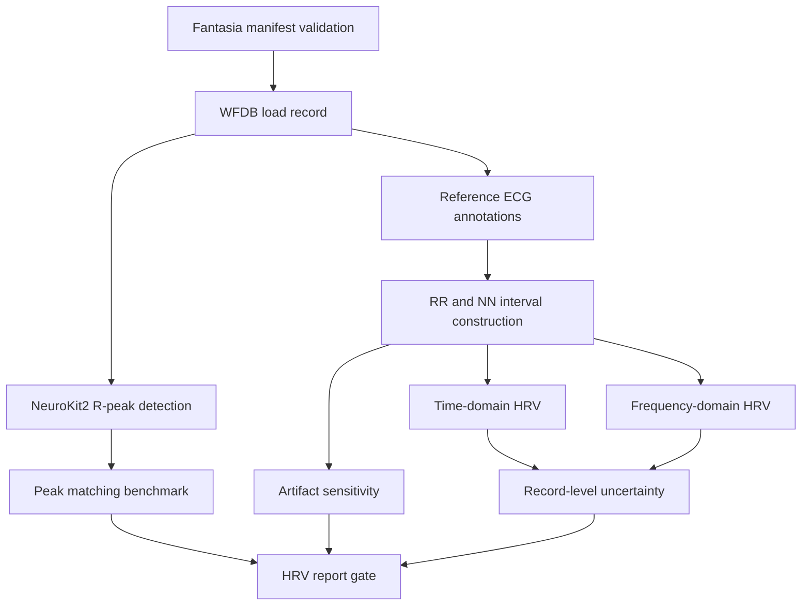
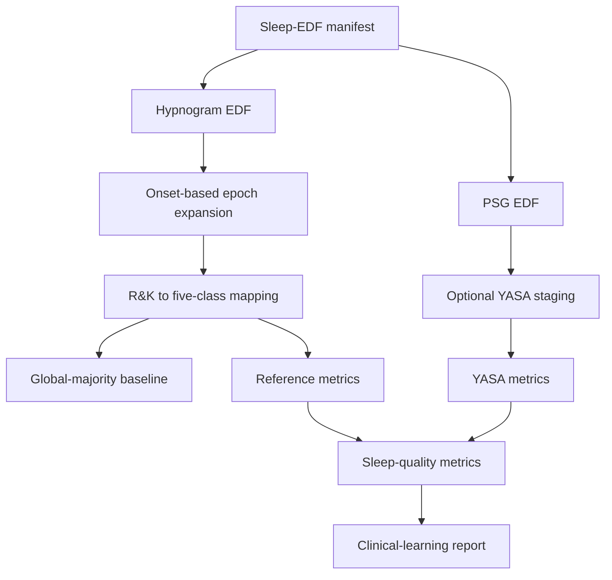
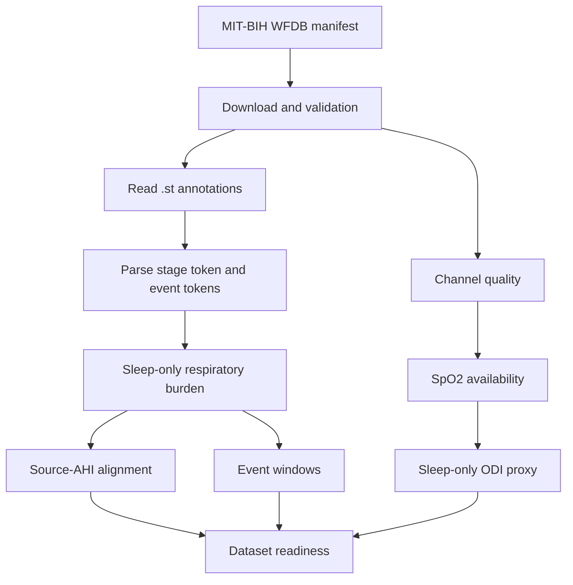

# Physio Signal Lab: Work Guide

> Audit subject: `Physiological_Signal_Analysis_no_raw_2026-06-23.zip`
> Audit date: 2026-06-23
> Conclusion: this is a relatively mature research and education prototype with three public-data physiological signal pipelines. It is not yet a clean-checkout reproducible release, and it is not clinical decision-support software.

## 1. Evidence Model

This guide separates evidence types so tracked artifacts are not confused with a fresh raw-data rerun.

| Label | Meaning | Example |
| --- | --- | --- |
| Repository-code evidence | Directly visible in source, config, tests, or file layout | `src/physio_signal_lab/features/hrv_time.py` implements SDNN |
| Tracked-artifact evidence | Existing CSV, report, or image artifacts committed to the repository | `results/sleep_edf/twenty_record_yasa_metrics.csv` |
| Historical repository statement | A report states that a run happened, but the current no-raw checkout cannot independently repeat it | `reports/project/final_state_and_technical_review_response.md` records `70 passed` |
| External background | Official documentation, papers, or related tools used for interpretation | PhysioNet, SciPy, YASA, HRV Task Force |

The public repository does not include `.git/` internals or `data/raw/`. Therefore a reader can inspect source, configuration, tests, tracked outputs, and reports, but cannot independently rerun the full waveform pipelines without restoring the public datasets.

## 2. Project Definition

### 2.1 Problem Statement

This repository is not a single-algorithm demo. It tries to make public physiological signal analysis auditable:

- `configs/` freezes dataset selection, algorithm parameters, and output paths.
- `data/manifests/` records source URL, local path, SHA-256, and inclusion status.
- `src/physio_signal_lab/cli.py` exposes the command-line workflows.
- `results/`, `reports/`, and `figures/` preserve machine-readable and human-readable outputs.
- `tests/` covers numerical logic, data contracts, report gates, and release metadata.

The current implementation covers three domains:

1. ECG / HRV method validation: R-peak detector benchmark, RR/NN construction, time/frequency-domain HRV, artifact sensitivity, and record-level uncertainty.
2. Sleep staging evaluation: Sleep-EDF R&K annotations mapped to five classes, global-majority baseline, YASA staging, sleep-quality metrics, and discrepancy analysis.
3. Respiratory / SpO2 educational analysis: MIT-BIH PSG `.st` annotation parsing, AHI-style burden, source-AHI alignment, ODI proxy, event windows, and dataset-readiness gates.

### 2.2 Dataset Background

These facts come from official dataset documentation and should not be treated as claims newly proven by this repository.

- [Fantasia Database v1.0.0](https://physionet.org/content/fantasia/1.0.0/) contains approximately two hours of resting ECG and respiration data from 20 young and 20 elderly healthy subjects, with beat annotations. This repository uses all 40 records.
- [Sleep-EDF Database Expanded v1.0.0](https://physionet.org/content/sleep-edfx/1.0.0/) contains whole-night PSG with R&K scored hypnograms. This repository selects the first available Sleep Cassette night for subjects 400-419, for 20 records.
- [MIT-BIH Polysomnographic Database v1.0.0](https://physionet.org/content/slpdb/1.0.0/) lists 18 records. This repository covers all 18 and separately identifies the pilot subset and records with an oxygen channel.

### 2.3 Intended Audience

The project is best understood as a method-development and education workbench for:

- researchers who need public data, traceable parameters, and result tables;
- technical readers learning ECG/HRV, sleep staging, or respiratory annotation analysis;
- developers building benchmark workflows rather than clinical products.

The phrases "clinical learning" and "clinical education" are educational framing. They do not imply clinical validation, diagnosis, treatment selection, or personal health advice.

## 3. Technical Stack

### 3.1 Packaging

`pyproject.toml` declares:

| Item | Value |
| --- | --- |
| Package name | `physio-signal-lab` |
| Version | `0.1.0` |
| Python | `>=3.11,<3.14` |
| Build backend | Hatchling |
| CLI entry point | `physio-signal-lab = physio_signal_lab.cli:main` |
| Lockfile | `uv.lock` |
| Core dependencies | Matplotlib, NeuroKit2, NumPy, pandas, PyYAML, SciPy, WFDB |
| `dev` extra | pytest |
| `sleep` extra | MNE, scikit-learn, YASA; YASA is installed only for Python `<3.13` |

Full Sleep/YASA workflows should use Python 3.12. Python 3.13 skips YASA because of the environment marker.

### 3.2 Dependency Roles

| Dependency | Role in this repository |
| --- | --- |
| WFDB | Reads Fantasia/MIT-BIH headers, signals, and annotations |
| NeuroKit2 | ECG cleaning and R-peak detection |
| SciPy | Welch PSD, Lomb-Scargle, Hungarian assignment |
| MNE | Reads Sleep-EDF PSG/Hypnogram EDF files |
| YASA | Automatic sleep staging and stage probabilities |
| scikit-learn | Sleep-stage metrics, including kappa and per-stage precision/recall/F1 |

## 4. Repository Architecture

```text
configs/                         YAML configuration
data/manifests/                  Input file and provenance contracts
docs/                            Public documentation; planning drafts are ignored
src/physio_signal_lab/           Python package
  cli.py                         CLI orchestration
  config.py                      Lightweight config checks
  manifest.py                    General/Fantasia manifest validation
  io/                            Fantasia, Sleep-EDF, MIT-BIH I/O
  evaluation/                    Peak matching, artifact, sleep staging
  features/                      HRV, RR/NN, sleep stage, uncertainty
  reporting.py                   HRV report gate
  release.py                     HRV release bundle
  sleep_edf_*.py                 Sleep preflight, benchmark, outputs
  sleep_quality.py               Sleep quality and clinical-learning report
  mit_bih_psg.py                 Respiratory/SpO2 workflow
results/                         Tracked CSV outputs
reports/                         Tracked Markdown reports
figures/                         Tracked PNG figures
tests/                           Regression tests
releases/hrv-core-v0.1.0/        HRV metadata release bundle
zh/                              Archived Chinese-language source documents
```

The largest maintainability hotspots are:

- `src/physio_signal_lab/mit_bih_psg.py`, which combines parsing, metrics, plotting, readiness policy, and reporting.
- `src/physio_signal_lab/sleep_quality.py`, which combines metrics, clinical heuristics, figures, and report generation.

## 5. CLI Surface

`src/physio_signal_lab/cli.py` defines the main commands:

```text
validate-data
inventory-fantasia
benchmark-peaks
run-rr-artifacts
run-frequency-hrv
build-report
freeze-release
run-sleep-edf-preflight
download-sleep-edf
validate-sleep-edf
run-sleep-edf-pilot-benchmark
profile-yasa-runtime
run-sleep-edf-clinical-education
download-mit-bih-psg
validate-mit-bih-psg
run-mit-bih-psg-respiratory-pilot
run-ecg-core
```

The CLI is useful, but not yet a polished public API. Optional dependency imports are still relatively eager, and subcommand help text is sparse.

## 6. Data, Manifest, And Output Contracts

### 6.1 Manifest Schema

The general manifest schema has these fields:

```text
dataset, version, doi, license, access_date, source_url,
record_id, local_path, sha256, included, exclusion_reason
```

Current manifests:

| Manifest | Purpose |
| --- | --- |
| `data/manifests/fantasia.csv` | Fantasia ECG/annotation files |
| `data/manifests/sleep_edf.csv` | Sleep-EDF PSG and hypnogram EDF files |
| `data/manifests/mit_bih_psg.csv` | MIT-BIH WFDB files |

Dataset licenses in the manifests describe the upstream public datasets. They are not the repository source-code license.

### 6.2 Validation Boundaries

The project has dataset-specific validation paths:

- Fantasia uses `validate_manifest()`.
- Sleep-EDF uses `validate_sleep_edf_manifest()`.
- MIT-BIH PSG uses `validate_mit_bih_psg_manifest()`.

The downloader fixes local SHA-256 values for fresh downloads. Existing skipped files do not overwrite expected checksums. The first download is still not independently cross-checked against an upstream checksum manifest.

### 6.3 Output Contract

The repository writes to fixed output paths. Sleep/MIT-BIH commands can use `output_prefix`; HRV output paths are mostly configured in YAML.

Missing future features:

- run ID;
- atomic output directory;
- config hash;
- input/output schema version;
- stale-output detection;
- complete run manifest.

## 7. ECG / HRV Pipeline

### 7.1 Execution Flow



### 7.2 R-Peak Benchmark

The detector benchmark compares NeuroKit2 detected peaks with reference annotations. Matching now prioritizes maximum match count and then minimum total absolute timing error.

Tracked summary:

- median F1 at 50 ms tolerance: `0.999361`;
- median absolute timing error: 8.0 ms;
- peak benchmark results are in `results/hrv/peak_benchmark/`.

### 7.3 RR/NN And HRV

Reference annotations are used to construct RR/NN intervals. Time-domain outputs include MeanNN, SDNN, RMSSD, and pNN50. Frequency-domain outputs compare Welch and Lomb-Scargle sensitivity.

Tracked snapshot:

- 285,494 reference intervals;
- 280,748 NN intervals;
- 4,746 excluded intervals;
- 977 frequency windows;
- 969 valid Welch windows.

### 7.4 Artifact Sensitivity

The artifact experiment includes:

- missed beat;
- spurious extra beat;
- timestamp jitter;
- ectopic-like short-long interval pairs.

The corrected artifact model uses beat timestamps as the canonical representation for duration-preserving perturbations.

### 7.5 HRV Limits

The HRV track supports method-development discussion. It does not support:

- personal baseline claims;
- disease detection;
- stress inference;
- device purchase advice;
- treatment decisions.

## 8. Sleep-EDF Pipeline

### 8.1 Execution Flow



### 8.2 Selection And Timeline

The current selected set covers the first available Sleep Cassette night for subjects 400-419. Annotation expansion derives `epoch_index` from real onset time and checks non-grid onset, overlap, and gaps.

Sleep-quality metrics now distinguish:

- elapsed-time metrics;
- observed-valid-time metrics;
- missing epoch count and missing minutes;
- continuity breaks;
- missing epochs within the sleep period.

### 8.3 Baselines And YASA

The benchmark distinguishes:

- `per_record_majority_oracle`: a descriptive target-aware baseline;
- `global_majority_stage_baseline`: a real global baseline;
- optional YASA predictions and probabilities.

Tracked twenty-record YASA snapshot:

- 54,587 included epochs;
- accuracy: `0.823310`;
- balanced accuracy: `0.721763`;
- macro-F1: `0.658405`;
- kappa: `0.675571`.

### 8.4 Sleep-Quality Learning

Sleep-EDF supports educational reasoning about:

- sleep architecture;
- total sleep time;
- WASO;
- sleep-period efficiency;
- REM latency;
- stage balance;
- fragmentation proxies;
- reference-vs-model discrepancy.

It cannot directly support AHI/RDI, oxygen desaturation burden, apnea/hypopnea diagnosis, PAP/oral-appliance treatment reasoning, hypoventilation reasoning, or respiratory-event severity.

## 9. MIT-BIH PSG Respiratory / SpO2 Pipeline

### 9.1 Execution Flow



### 9.2 Annotation Parsing

The `.st` annotation parser treats the first token as sleep stage and later tokens as events. Respiratory token sets include hypopnea, obstructive apnea, central apnea, and arousal-associated respiratory tokens.

AHI-style burden is:

```text
sleep-only respiratory event token count / sleep hours
```

This is an educational annotation burden, not a clinical AHI reconstruction.

### 9.3 Oxygen And ODI Proxy

SO2 metrics are computed only when a plausible oxygen channel exists. The current scorer is a documented pre-event rolling-baseline ODI proxy. It reports 3% and 4% desaturation-style rates, but it is not a validated clinical ODI implementation.

### 9.4 Dataset Readiness

Readiness combines:

- source-AHI alignment;
- respiratory annotation burden;
- SO2 availability;
- oxygen artifact review status.

Tracked summary:

- 18 records analyzed;
- source alignment: 10 manual review, 6 roughly aligned, 2 source-context-only;
- oxygen review: 13 unavailable, 3 artifact review, 2 ready;
- records suitable for respiratory annotation-burden learning: `slp01a`, `slp02a`, `slp02b`, `slp03`, `slp37`, `slp61`.

## 10. Current Completion State

### 10.1 Scale

| Area | Tracked scale |
| --- | --- |
| Source files | Python package plus CLI |
| Tests | Regression tests for numerical functions, data contracts, reporting, and release behavior |
| Results | Tracked CSV artifacts under `results/` |
| Reports | Markdown reports under `reports/` |
| Figures | PNG figures under `figures/` |

### 10.2 Historical Full-Data Validation

`reports/project/final_state_and_technical_review_response.md` records the latest full-data closure state:

- `pytest`: 70 passed;
- Fantasia validation: 0 missing files and 0 checksum mismatches;
- Sleep-EDF validation: 40 EDF files, 998,070,310 bytes, 0 missing files and 0 checksum mismatches;
- MIT-BIH PSG validation: 72 WFDB files, 662,914,296 bytes, 0 missing files and 0 checksum mismatches.

Those statements require raw data to independently repeat.

## 11. Running From A Fresh Checkout

### 11.1 Environment

```bash
uv sync --frozen --python 3.12 --extra dev --extra sleep
uv run physio-signal-lab --help
uv run pytest -q
```

### 11.2 Data

Restore raw data under `data/raw/` according to:

```text
data/manifests/fantasia.csv
data/manifests/sleep_edf.csv
data/manifests/mit_bih_psg.csv
```

### 11.3 HRV

```bash
uv run physio-signal-lab validate-data \
  --manifest data/manifests/fantasia.csv

uv run physio-signal-lab run-ecg-core \
  --config configs/hrv/core.yaml
```

### 11.4 Sleep-EDF

```bash
uv run physio-signal-lab download-sleep-edf \
  --config configs/sleep_edf/default.yaml

uv run physio-signal-lab validate-sleep-edf \
  --config configs/sleep_edf/default.yaml

uv run physio-signal-lab run-sleep-edf-pilot-benchmark \
  --config configs/sleep_edf/default.yaml \
  --records SC4001,SC4011 \
  --output-prefix pilot \
  --include-yasa
```

### 11.5 MIT-BIH PSG

```bash
uv run physio-signal-lab download-mit-bih-psg \
  --config configs/mit_bih_psg/default.yaml

uv run physio-signal-lab validate-mit-bih-psg \
  --config configs/mit_bih_psg/default.yaml

uv run physio-signal-lab run-mit-bih-psg-respiratory-pilot \
  --config configs/mit_bih_psg/default.yaml \
  --output-prefix all_record
```

## 12. Verification Strategy

Input-layer checks:

- manifest files exist and parse;
- included files are present;
- SHA-256 values match where expected values exist;
- raw data remain outside Git.

Numerical checks:

- peak matching edge cases;
- HRV time-domain regressions;
- artifact duration invariants;
- sleep timeline gap/overlap/non-grid regressions;
- MIT-BIH annotation, oxygen, source-AHI, and readiness regressions.

Output-layer checks:

- report gates use current manifest validation;
- output completeness is checked before pass decisions;
- release directories do not mix stale files;
- generated outputs retain explicit limitations.

## 13. Troubleshooting

| Symptom | Likely cause | First response |
| --- | --- | --- |
| `ModuleNotFoundError: wfdb` | Environment not synced | Run `uv sync --frozen --extra dev` or full sleep sync |
| `ModuleNotFoundError: yasa` | Python 3.13 or missing sleep extra | Use Python 3.12 and `--extra sleep` |
| Manifest validation fails | Missing raw files, wrong paths, or hash mismatch | Restore files from upstream; do not rewrite hashes first |
| YASA is slow or times out | Full-night staging is expensive | Run `profile-yasa-runtime` first |
| Report gate fails in no-raw checkout | Raw files intentionally absent | Treat as expected unless validating full-data state |

## 14. Comparison With Related Tools

This repository does not aim to replace NeuroKit2, pyHRV, HeartPy, MNE, YASA, or WFDB. Its distinctive value is workflow assembly:

- dataset-specific manifests;
- explicit provenance;
- artifact and uncertainty tables;
- educational reports with evidence boundaries;
- readiness gates that prevent proxies from being overclaimed.

Its weaknesses are also clear:

- algorithm breadth is narrower than mature libraries;
- clean-install polish is incomplete;
- end-to-end validation still depends on restored public raw data;
- release snapshots are not yet fully self-contained.

## 15. Technical Assessment

Strengths:

- real public datasets;
- configuration-driven workflows;
- tracked machine-readable outputs;
- explicit clinical caveats;
- meaningful correctness closure for provenance, sleep timeline, artifact span, and report gates.

Limitations:

- no full CI matrix;
- no hermetic tiny integration dataset;
- large mixed-responsibility domain modules;
- incomplete release reproducibility;
- educational clinical proxies, not validated medical metrics.

## 16. Recommended Future Work

The project is currently closed for implementation, but if reopened the most defensible order is:

1. Make a clean checkout verifiable without full public raw data by adding tiny synthetic fixtures.
2. Add CI for compile/test/whitespace/secret checks.
3. Add schema validation for YAML config and output tables.
4. Split `mit_bih_psg.py` and `sleep_quality.py` into smaller modules.
5. Add run manifests, output hashes, and atomic output directories.
6. Manually adjudicate MIT-BIH source-AHI rows and SO2 artifact records.
7. Build a v0.2 frozen reproducibility snapshot.

Two possible long-term routes:

- **Route A: research-platform hardening**: stable CLI/API, reproducible releases, synthetic fixtures, schemas, and CI.
- **Route B: clinical-method validation research**: expert adjudication, external scorer comparisons, ODI/AHI agreement, and governance. This route has a much higher evidence burden.

## 17. Internal Evidence Index

| Topic | Evidence |
| --- | --- |
| CLI | `src/physio_signal_lab/cli.py` |
| Configs | `configs/hrv/core.yaml`, `configs/sleep_edf/default.yaml`, `configs/mit_bih_psg/default.yaml` |
| Manifests | `data/manifests/*.csv` |
| HRV reports | `reports/hrv/core_report.md` |
| Sleep reports | `reports/sleep_edf/` |
| MIT-BIH reports | `reports/mit_bih_psg/` |
| Project state | `reports/project/final_state_and_technical_review_response.md`, `reports/project/project_state_summary.md` |
| Chinese source archive | `zh/` |

## 18. External References

### Data And Formats

- [Fantasia Database v1.0.0](https://physionet.org/content/fantasia/1.0.0/)
- [Sleep-EDF Database Expanded v1.0.0](https://physionet.org/content/sleep-edfx/1.0.0/)
- [MIT-BIH Polysomnographic Database v1.0.0](https://physionet.org/content/slpdb/1.0.0/)
- [WFDB Python documentation](https://wfdb-python.readthedocs.io/en/latest/)
- [MNE `read_raw_edf`](https://mne.tools/stable/generated/mne.io.read_raw_edf.html)

### Algorithms And Standards

- [NeuroKit2 ECG API](https://neuropsychology.github.io/NeuroKit/functions/ecg.html)
- [NeuroKit2 paper](https://doi.org/10.3758/s13428-020-01516-y)
- [SciPy Welch PSD](https://docs.scipy.org/doc/scipy/reference/generated/scipy.signal.welch.html)
- [SciPy Lomb-Scargle](https://docs.scipy.org/doc/scipy/reference/generated/scipy.signal.lombscargle.html)
- [YASA SleepStaging](https://yasa-sleep.org/generated/yasa.SleepStaging.html)
- [YASA paper](https://doi.org/10.7554/eLife.70092)
- [HRV Task Force standards](https://doi.org/10.1161/01.CIR.93.5.1043)
- [AASM hypopnea scoring discussion](https://doi.org/10.5664/jcsm.9952)

### Related Tools

- [pyHRV](https://github.com/PGomes92/pyhrv)
- [HeartPy](https://github.com/paulvangentcom/heartrate_analysis_python)
